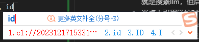
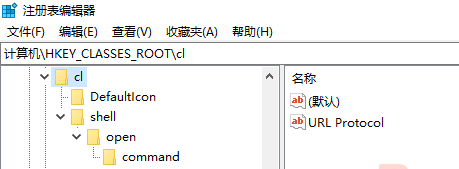
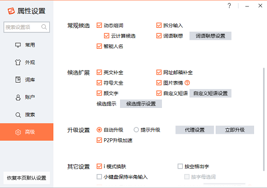

# ObsidianPlugins-CrossLinkProtocol
当前markdown的链接机制有各种问题，这里提出一种基于查找的链接机制，实现更加灵活、易于维护的链接。

## 功能
* CrossLink机制包含两种链接：定义链接和引用链接。定义链接代表一个概念，引用链接代表引用了这个链接。例如：
  ```markdown
  [LLM](cl://llm/def)是指使用大量文本数据训练的深度学习模型.

  GPT是一种[大规模预训练语言模型](cl://llm/ref)。
  ``` 
  前者是定义链接，后者是引用链接。
* 双向链接：
    * 当点击定义链接时，会自动搜索`/llm(?!\/def)/`。这是obsidian搜索框使用的JS风格的正则表达式，意思就是搜素llm，但后边不能是/def。也就是说llm/ref会被搜到，但llm/def不会被搜到。
    * 当点击引用链接时，会自动搜索`llm/def`。
    * 通过如上方式，电仪引用链接可以找到对应概念（正向链接）；点击定义链接就可以定位到所有引用了这个概念的文段（反向链接）
* 自动编码：当出现一个新的概念，比如llm，那么就需要创建定义链接，例如上文中的`cl://llm/def`。但在实现中其实使用了一个唯一id，例如`cl://20231215235116/def`，这里的20231215235116就是llm这个概念的id。在这个文档中为了方便理解，使用llm代替了对应的字符（下文也有类似操作，不再解释）。而自动编码就是自动生成这段文字。中文输入法输入`id`，就可以自动生成了，如下图。


## 实现

### 双向链接
本项目基于[自定义URL协议](cl://20230429163000/use)，所以也是分为注册协议和编写程序两个部分，最后再加上一个应用验证。

#### 注册协议
* 打开注册表编辑器
* 在`计算机\HKEY_CLASSES_ROOT`下建立如下的注册表结构（cl代表cross link）：
  
* 在cl项下新建字符串值URL Protocol，值是空字符串。
* 在cl项下的默认值改为`URL:cl`。
* 把DefaultIcon项下的默认值改为要调用的语言引擎路径。我们是基于python实现，所以这里写python解释器的路径`D:\ProgramFiles\anaconda3\python.exe`。
* 把command项下的默认值改为`D:\ProgramFiles\anaconda3\python.exe D:\ProgramFiles\CrossLink\ObsidianPlugins-CrossLinkProtocol\main.py %1`：
* 至此协议就注册完毕，以后访问“cl://20230429163000/def”这样的URL时，就会在命令行运行`D:\ProgramFiles\anaconda3\python.exe D:\ProgramFiles\CrossLink\ObsidianPlugins-CrossLinkProtocol\main.py %1`这样的指令。

#### 编写程序
* 创建python程序`D:\ProgramFiles\CrossLink\ObsidianPlugins-CrossLinkProtocol\main.py。
* 程序内容参见本项目。

### 自动编码
以搜狗输入法为例，打开属性设置,点击自定义短语设置。

选择“直接编辑配置文件”
在打开的配置文件中添加一条：`id,1=#cl://$year$month_mm$day_dd$fullhour_hh$minute$second/def`。
也可以添加更多，反正就是这个语法。例如：
* `def,1=#[<sup>⚓</sup>](cl://$year$month_mm$day_dd$fullhour_hh$minute$second/def)`
* `ref,1=[<sup>🔗</sup>](cl:///ref)`
这样就可以通过输入id、def和ref来方便的输入对应那一长串代码了。

# 高级功能
CrossLink基本架构就是def和ref，但是你可以扩展ref的类型，例如(fc是father class，cc是child class)：
```
[GPT](cl://gpt/def) is xxxx.
[LLM](cl://llm/def) is xxxx.
[NER](cl://ner/def) is xxxx.

[GPT](cl://gpt/fc)  is a kind of [LLM](cl://llm/cc).
[LLM](cl://llm/usage)-based [NER](cl://ner/method)
```
这里ref被替换为fc、cc、uasge和method以表达更加具体和含义。
如果你想看看LLM都有哪些类型，那么就可以搜索cl://llm/cc。
我自己使用的ref类型有：cc、fc；usage、method；class、instance；include、partof。
但其实笔记中一般没有这么强的语义化需求，还是def、ref用的多。
